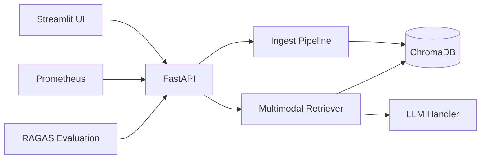

# Multimodal RAG App

Production-style **Retrieval-Augmented Generation** over PDFs, images, and audio. FastAPI backend, Streamlit UI, ChromaDB vector store, and optional OpenAI answers.

## Architecture



| Modality | Processing | Embedding |
|----------|------------|-----------|
| PDF / TXT | Unstructured.io parsing (tables, charts) | MiniLM text |
| Image | PIL + caption stub | CLIP ViT-B/32 |
| Audio | Whisper transcription | MiniLM text |

## Key Features

- **Advanced Document Parsing**: Uses Unstructured.io to extract tables, charts, and structured content from PDFs
- **Hybrid Search**: Combines BM25 sparse search with dense vector search for improved retrieval
- **Re-ranking**: Optional Cohere re-ranking to optimize result relevance
- **Vision-Language Model**: GPT-4o integration for multimodal synthesis with images and text
- **WebSocket Streaming**: Real-time streaming of query responses
- **Faithfulness Scoring**: RAGAS evaluation to detect hallucinations and ensure answer quality

## Quick start

```bash
cd multimodal-rag-app
python -m venv .venv
.venv\Scripts\activate          # Windows
pip install -r requirements.txt
copy .env.example .env

python scripts/database_setup.py
python scripts/migrate_data.py   # after adding files to data/

uvicorn src.main:app --reload --port 8000
streamlit run frontend/app.py
```

Open http://localhost:8501 for the UI, http://localhost:8000/docs for the API.

## Docker

```bash
cp .env.example .env
docker compose up --build
```

- API: http://localhost:8000  
- UI: http://localhost:8501  
- Prometheus: http://localhost:9090  

## API endpoints

| Method | Path | Description |
|--------|------|-------------|
| GET | `/health` | Status and indexed count |
| POST | `/ingest/file` | Upload single file |
| POST | `/ingest/directory` | Index `data/` folder |
| POST | `/query` | RAG question (synchronous) |
| WS | `/ws/query` | RAG question (WebSocket streaming) |
| GET | `/metrics` | Prometheus metrics |
| DELETE | `/collection` | Reset index |

## Configuration

- `configs/model_config.yaml` — embeddings, LLM, chunking, retrieval, observability  
- `configs/db_config.yaml` — Chroma paths and collection  
- `.env` — secrets and overrides  

### Environment Variables

- `OPENAI_API_KEY` — Required for GPT-based answers and vision-language models
- `COHERE_API_KEY` — Required for re-ranking feature
- `LLM_PROVIDER` — Set to `openai` for GPT-based answers, `local` for fallback

### Model Config Options

- `retrieval.use_hybrid` — Enable BM25 + vector hybrid search
- `retrieval.use_rerank` — Enable Cohere re-ranking
- `parsing.use_unstructured` — Enable advanced PDF parsing with Unstructured.io
- `observability.use_ragas` — Enable RAGAS faithfulness evaluation

## Advanced Features

### Hybrid Search
The system supports hybrid search combining BM25 (sparse) and vector (dense) search for improved retrieval accuracy. Enable in `configs/model_config.yaml`:

```yaml
retrieval:
  use_hybrid: true
  bm25_k1: 1.5
  bm25_b: 0.75
```

### Re-ranking
Cohere re-ranking can be enabled to optimize result relevance after retrieval:

```yaml
retrieval:
  use_rerank: true
  rerank_model: cohere
  rerank_top_k: 10
```

Requires `COHERE_API_KEY` in `.env`.

### Vision-Language Model
When image contexts are retrieved, the system automatically uses GPT-4o for multimodal synthesis:

```yaml
llm:
  vision_model: gpt-4o
```

Requires `OPENAI_API_KEY` in `.env`.

### WebSocket Streaming
For real-time streaming of responses, connect to the WebSocket endpoint:

```javascript
const ws = new WebSocket('ws://localhost:8000/ws/query');
ws.send(JSON.stringify({
  query: "Show me the revenue chart",
  top_k: 5
}));
```

### Faithfulness Evaluation
RAGAS evaluates answer faithfulness to detect hallucinations:

```yaml
observability:
  use_ragas: true
```

Low faithfulness scores (< 0.5) trigger warnings in responses.

## Project layout

```
multimodal-rag-app/
├── configs/          # Hyperparameters
├── data/             # Raw PDFs, images, audio
├── docs/             # Model cards
├── frontend/         # Streamlit UI
├── notebooks/        # R&D notebooks
├── pipelines/        # DVC pipeline
├── scripts/          # DB setup & migration
├── src/              # Core application
├── tests/            # PyTest suite
└── monitoring/       # Prometheus config
```

## Tests

```bash
set PYTHONPATH=.
pytest tests/ -v
```

## License

MIT
